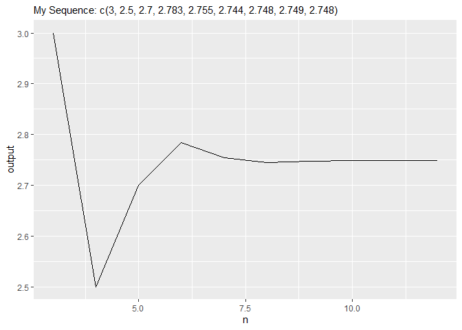

<!-- README.md is generated from README.Rmd. Please edit that file -->

IFEBUNANDU OKEKE Github ID: Fubu83

# fubupackage

<!-- badges: start -->
<!-- badges: end -->

The goal of fubupackage is to …

## Installation

You can install the released version of fubupackage by asking me for it.

``` r
install.packages("fubupackage")
```

## Example

This is a basic example which shows you how to solve a common problem:

``` r
library(fubupackage)
## basic example code
```

This function takes as input a vector x containing the first three
numeric elements of this sequence and a positive (&gt;0) integer n
denoting the final nth element of the sequence to calculate. The
function returns element n.

# 1. Function 1

``` r
myseq_n = function(x, n) {
  stopifnot(length(x) == 3)
  stopifnot(length(n) == 1)
  if (n <= 0) {
    stop("to proceed, n must be greater than 0")
  } else if (n >= 1 & n <= 3) {

    return(x[n])
  }
  else {
    for (i in 4:n) {
      x[i] = x[i-1] + (x[i-3] - x[i-2])/i
    }

  }
  return(x[n])
}
```

# Function Test

``` r
myseq_n(x = c(2,3,3), n = 3)
#> [1] 3
myseq_n(x = c(2,4,3), n = 4)
#> [1] 2.5
myseq_n(x = c(2, 4, 3), n = 5)
#> [1] 2.7
myseq_n(x = c(2, 4, 3), n = 6)
#> [1] 2.783333
myseq_n(x = c(2, 4, 3), n = 7)
#> [1] 2.754762
```

# Function 2

This function allows a user to input a data frame with four columns: The
first three columns are the values of the three numerics to be input to
function 1 and the fourth column is the positive integer n for the
sequence to be generated. This function should return a line plot of the
output values for the different values of n. It should look similar to
the following for the test values below:

``` r
myseq_n_2 <- function(df){
  stopifnot(length(df) == 4)
  output <- vector(mode = "numeric", length = length(df[[4]]))
  for (i in seq_along(df[[4]])) {
    output[i] <- myseq_n(x = cbind(df[[1]][i], df[[2]][i], df[[3]][i]), n = df[[4]][i])
    df_2 <- cbind(df, output)
    n <- df_2[[4]]

    ggplot2::ggplot(data = df_2, ggplot2::aes(x = n, y = output)) +
      ggplot2::geom_line() +
      ggplot2::labs(subtitle = "My Sequence: c(3, 2.5, 2.7, 2.783, 2.755, 2.744, 2.748, 2.749, 2.748)") -> plot
  }
  return(plot)
}
```

# Test function for 2

``` r
my_data <- tibble::tribble(
~x, ~y, ~z, ~n,
2,4,3,3,
2,4,3,4,
2,4,3,5,
2,4,3,6,
2,4,3,7,
2,4,3,8,
2,4,3,9,
2,4,3,10,
2,4,3,12)

myseq_n_2(my_data)
```


